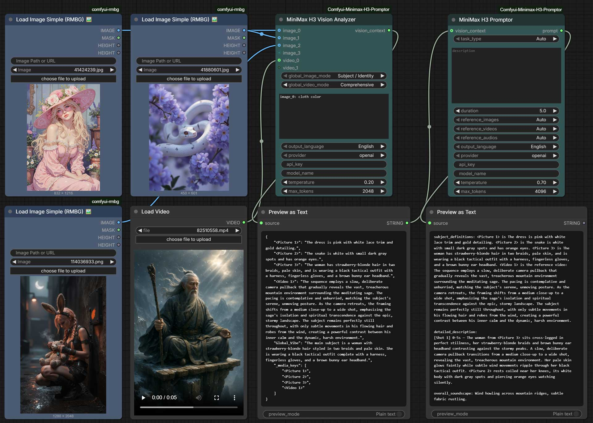

# 🎬 ComfyUI MiniMax H3-Promptor

A powerful, node-based automation suite for generating cinema-production-grade prompts explicitly formatted for the **MiniMax H3 Video Generation System**.

This project provides a robust, decoupled architecture separating **multimodal visual analysis** from pure **text-based prompt structuring**, allowing for extreme customizability, precise scene description, and low API operating costs.



---

## 🎉 What's New in [V1.1.0](updates.md#release-notes-v110) (Refined Architecture)

*   **Zero-Hallucination Inline Tagging**: The Prompt LLM now natively embeds `<Picture X>` references directly inside the narrative action lines, guaranteeing 100% compliance with official MiniMax tag-binding requirements.
*   **Sequential Multi-Modal Processing**: Upgraded the Vision Analyzer to process inputs sequentially. This eliminates Multi-Modal LLM context bleeding and guarantees proxy API limits are never exceeded.
*   **Flawless 6-Part Official Syntax Compliance**: Our structural generation has been de-patched. The Promptor now strictly assembles the mandatory 6-part string array (`subject_definitions`, `summary`, `retention`, etc.) in the exact sequence HuggingFace mandates.
*   **Audio Pipeline Fix**: Completely restored routing logic for Native Audio paths (Audio-to-Video and Image-to-Audio).
*   **Custom Node Theming**: Added native UI coloring support for ComfyUI (`appearance.js`).

---

## 🌟 The V1.0.0 Decoupled Architecture

The pipeline consists of two nodes working in tandem to handle extreme complexity without duplicating LLM vision costs:

### 1. `H3_Vision_Analyzer` 👁️
A highly configurable multimodal analysis engine. This node acts as your virtual Director of Photography, analyzing input imagery and video based on explicit presets.
*   **Infinite Dynamic Scaling**: Upgraded to ComfyAPI v3 `io.Autogrow`. You are no longer limited to 4 images. Connect as many Images and Videos as you want seamlessly.
*   **Targeted Custom Overrides**: Use the `custom_prompt_override` box to type rules like `<Picture 2>: Focus entirely on the background`. It will surgically override the global mode for that exact frame!
*   **Invisible Heavy VRAM Management**: Automatically detects when you are using local models like `Ollama` and safely unloads them behind the scenes to preserve VRAM for the actual H3 video generation.
*   **Multilingual Output**: Choose between English and Chinese for the analysis output language.
*   **Model Agnostic Instruction Profiles**: The node is only an LLM text/VLM analyser, so the instruction set is selectable (`instruction_profile`). Ship with `MiniMax H3` and `LTX 2.5`, add your own in `vision_prompts.json`.
*   **One Text Output per Reference**: `vision_context` is still output #0, but every reference also gets its own `image_N_text` / `video_N_text` / `audio_N_text` output, plus a dedicated `global_vibe` output for the synthesis of the whole scene.

#### Vision Analyzer Inputs
| Parameter | Type | Description |
|-----------|------|-------------|
| `ref_images` | IMAGE | Connect one or multiple images; dynamically grows infinitely (`image_X`). |
| `ref_videos` | IMAGE | Connect video tensor sequences; dynamically grows (`video_X`). |
| `global_image_mode` | COMBO | Selects the global fallback analysis logic from `vision_prompts.json` for all images. |
| `global_video_mode` | COMBO | Selects the global fallback analysis logic from `vision_prompts.json` for all videos. |
| `custom_prompt_override`| STRING | A multi-line box to surgically override specific media logic. E.g: `<Picture 2>: focus on the lighting` or `Global_Vibe: one shared neon-noir world`. |
| `output_language` | COMBO | Language for the analysis output (`English` or `Chinese`). |
| `provider` | COMBO | `openai`, `ollama`, `gemini`, `claude`, `openrouter` or `nvidia`. |
| `api_key` | STRING | API Key override (leaves `config.json` untouched). |
| `model_name` | STRING | VLM Model override (e.g. `gpt-4o`, `gemini-2.5-flash`). |
| `temperature` | FLOAT | Sampling temperature. Default `0.2` for precise factual analysis. |
| `max_tokens` | INT | Maximum response tokens (256-8192). |
| `instruction_profile` | COMBO | Which instruction set to use. Ship with `MiniMax H3` and `LTX 2.5`; add your own profiles in `vision_prompts.json`. This is what makes the node usable for **any** target model. |
| `global_vibe_mode` | COMBO | Instruction for the text-only `Global_Vibe` synthesis of the whole scene (`Profile Default` = first entry of the selected profile). |
| `global_audio_mode` | COMBO | Instruction used for every audio reference (replaces the previously hard-coded audio prompt). |

#### Vision Analyzer Outputs
| Output | Type | Description |
|--------|------|-------------|
| `vision_context` | STRING | **Output #0, unchanged.** Full JSON context consumed by `H3_Promptor` (also carries `Global_Vibe` and `_media_keys`). |
| `global_vibe` | STRING | Scene-level `Global_Vibe` synthesized from every reference. |
| `image_1_text` … `image_9_text` | STRING | Description produced for `<Picture N>`; empty string when that slot is not connected. |
| `video_1_text` … `video_3_text` | STRING | Description produced for `<Video N>`; empty string when unused. |
| `audio_1_text` … `audio_3_text` | STRING | Description produced for `<Audio N>`; empty string when unused. |

> The per-slot outputs let you drive **any** other node (e.g. an LTX 2.5 prompt builder) with one exact description per reference, without parsing the JSON yourself.

### 2. `H3_Promptor` 📝
The core structure engine. It operates at blazing speeds because it takes the user's description and the Vision Analyzer's text report to format the final H3 Prompt—meaning **it does not need to repeatedly analyze heavy images.**
*   **Intelligent Cross-Node `Auto` Detection**: Even though this node no longer connects to images directly, the `H3_Vision_Analyzer` invisibly stamps a hidden `[MEDIA_SIGNATURE]` encoded with your exact inputs. The `H3_Promptor` silently parses this signature and automatically selects the correct generation mode:

| Vision Inputs | Auto-Detected Mode |
|---|---|
| No media connected | **T2V** — Text-to-Video |
| 1 image | **I2V** — Image-to-Video |
| 2 images | **FL2VA** — First & Last Frame |
| 3-4 images | **Ref2VA** — Omni Reference |
| Video only | **V2V** — Video-to-Video |
| Any images + Video | **Ref2VA** — Omni Reference |

*   **Language Selection**: Output the final cinematic prompt strictly in **Chinese (简体中文)** or **English**, seamlessly bridging international setups.
*   **Duration Syncing**: Define how long your video is (4-15s), and the LLM will rigorously pace the structural shot-list to match that exact timeframe at 24FPS.

#### Promptor Inputs
| Parameter | Type | Description |
|-----------|------|-------------|
| `task_type` | COMBO | The generation mode (`Auto`, T2V, I2V, FL2VA, etc.). Auto is recommended. |
| `description` | STRING | Your main creative description of the video scene. |
| `duration` | INT | Desired video length (4-15 seconds). |
| `vision_context` | STRING | Connect the output of `H3_Vision_Analyzer` here. Leave unconnected for pure T2V. |
| `output_language` | COMBO | Output the resulting prompt in `English` or `Chinese`. |
| `provider` | COMBO | `openai`, `ollama`, `gemini`, or `claude`. |
| `api_key` | STRING | API Key override. |
| `model_name` | STRING | Model override (e.g. `gpt-4o`, `claude-sonnet-4-20250514`). |
| `temperature` | FLOAT | Sampling temperature. Default `0.7` for creative writing. |
| `max_tokens` | INT | Maximum response tokens (256-8192). |

---

## 🔌 Supported LLM Providers

All 4 providers are implemented as **independent, native API integrations** — no wrappers, no compatibility layers. Each provider file is fully self-contained for easy maintenance.

| Provider | File | API Format | Default Model | Auth Method |
|---|---|---|---|---|
| **OpenAI** | `provider_openai.py` | `/v1/chat/completions` | `gpt-4o` | `Bearer` Token |
| **Ollama** | `provider_ollama.py` | Ollama `/api/chat` | `llama3.1` | None (local) |
| **Gemini** | `provider_gemini.py` | Google `generateContent` | `gemini-2.5-flash` | URL `?key=` param |
| **Claude** | `provider_claude.py` | Anthropic Messages API | `claude-sonnet-4-20250514` | `x-api-key` Header |

> **Local & Compatible APIs (LMStudio, llama.cpp, DeepSeek, etc.)**: 
> Because LMStudio, llama.cpp, vLLM, and many other providers use the standard OpenAI API format, they are fully supported out of the box! Simply select **OpenAI** as your provider and update the `"api_base"` URL in your `config.json` to point to your local or custom endpoint (e.g., `"http://localhost:1234/v1"` for LMStudio). You can use any dummy string for local API keys.
> 
> *Popular compatible APIs you can use with the OpenAI setting:*
> *   **DeepSeek**: Highly affordable and powerful models, very popular.
> *   **Groq**: Lightning-fast inference API powered by LPU hardware.
> *   **OpenRouter**: A model aggregator platform widely used by international users.
> *   **Together AI / SiliconFlow**: APIs providing access to various open-source models (like Llama 3).

> All providers support multimodal (image) inputs for the Vision Analyzer node.

---

## 🌟 Workflow Recipes & Tutorials

Want to learn how to do **Lip-Syncing, Character Interaction, Video Style Transfer**, or **High-End Product Commercials**?

👉 **[Click here to view the Master Workflow Tutorials](tutorials.md)**
👉 **[点击这里查看 8 大经典实战工作流教程 (中文版)](tutorials_zh.md)**

---

## 🚀 Installation & Setup

1. **Clone the Repository**:
   Clone this repo into your `ComfyUI/custom_nodes` folder:
   ```bash
   cd ComfyUI/custom_nodes
   git clone https://github.com/1038lab/Comfyui-Minimax-H3-Promptor.git
   ```
2. **Install Dependencies**:
   ```bash
   pip install -r requirements.txt
   ```
3. **Configuration (`config.json`)**:
   On first load, the node will auto-create a `config.json` inside its folder. Open it and fill in your API keys:
   ```json
   {
     "providers": {
       "openai":  { "api_key": "sk-..." },
       "gemini":  { "api_key": "AIza..." },
       "claude":  { "api_key": "sk-ant-..." }
     }
   }
   ```
   > You can also override API keys directly on each node's UI without editing config.json.

---

## 🎨 Modding & Customization

### The `vision_prompts.json` Ecosystem
`vision_prompts.json` holds one entry per **instruction profile**. A profile is a named bundle of instructions for one target format (`MiniMax H3`, `LTX 2.5`, or anything you add):

```json
{
    "profiles": {
        "MiniMax H3": {
            "system_prompt": "You are an expert film director and multimedia analyst...",
            "global_vibe_system_prompt": "You are a senior film director and colourist...",
            "image_prompts":   { "Subject / Identity": "...", "Comprehensive": "..." },
            "video_prompts":   { "Motion Focus": "...", "Comprehensive": "..." },
            "audio_prompts":   { "Comprehensive Audio": "...", "Music & Score": "..." },
            "global_vibe_prompts": { "Continuity & Shared World": "...", "Mood & Atmosphere": "..." }
        },
        "LTX 2.5": { "...": "same shape, LTX flavoured instructions" }
    }
}
```

Rules that matter:

* The **first** key of every section is that profile's `Profile Default`, i.e. what the node uses when the dropdown is set to `Profile Default`.
* The node dropdowns list the **union** of all profiles, so a mode that is not defined in the active profile is still resolved from the profile that defines it (saved workflows never break).
* A profile section found in the file **replaces** the built-in section with the same name; sections you leave out keep the built-in defaults. `_readme` is ignored.
* Old flat preset files (top-level `image_prompts` / `video_prompts`) are still read and are applied to the `MiniMax H3` profile.
* `system_prompt` = instructions for the per-media analysis calls, `global_vibe_system_prompt` = instructions for the text-only `Global_Vibe` synthesis (keep its JSON contract `{"Global_Vibe": "..."}`).

Changes take effect after a ComfyUI restart.

#### Using the node for LTX 2.5 (or any other model)
1. Set `instruction_profile` to `LTX 2.5` (or paste your own LTX instructions into a new profile in `vision_prompts.json`).
2. Pick the per-media instructions with `global_image_mode` / `global_video_mode` / `global_audio_mode`.
3. Wire `image_1_text`, `image_2_text`, … directly into your LTX prompt node - each output is the plain description of that reference. `vision_context` / `global_vibe` still work if you prefer the combined text.

### The System Templates
Want to alter how the backend formats the `[SCENE]` blocks?
Open the `templates/` directory. The `system_base.txt` controls global rules, while the other text files (e.g., `i2v.txt`) control the exact formatting structure based on the mode you selected.

---

##  Credits & Resources

*   Developed by **[1038lab](https://github.com/1038lab)**.
*   **MiniMax H3 Specifications**: Designed specifically to interface with the core structural requirements given by MiniMax.

## License

GPL-3.0
